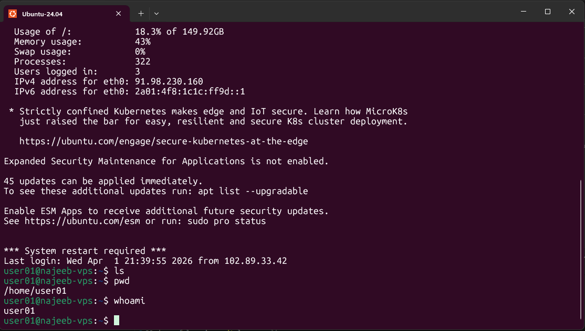

# Day 01 - [Topic]

## Objective

What was the goal for today?

1. Why master the command line (Linux)
2. What is UNIX system
3. What is **Shell**
4. What is **Terminal**
5. Connect to a Virtual Machine (VM)

## What I Learned

1.
    - Mastering the command line gives you more control over your machine. You can run commands to change permissions, view hidden files, interact with databases, start severs, manage processes, etc.
    - Can perform tasks faster than you could using GUI. Automate many tasks. Cloud computing
2.
    - UNIX is a multitasking and multiuser operating system designed to provide a stable, secure, and efficient computing environment.
    - UNIX os organizes its components into hierarchical levels-hardware, kernel, system utilities, and applications to ensure efficient, secure, and modular system functioning.
    - **Kernel** is the core and essential part of UNIX os. It acts as the central controlling unit that manages all system resources and enables communication between hardware and software
3. 
    - A shell is a computer interface to an operating system.
    - Shells expose the OS's services to human users or other programs
    - The Shell takes our command and gives it to the OS system to perform
4. A terminal is a program that runs a shell

---

## What I Built / Practiced

- Connected to a VM
- print working directory
- checked for the username
- moved up the directory


---

## Challenges Faced

- None

---

## Key Takeaways

- **Kernel** being a central controlling unit that enables communication between hardware and software
- A **Shell** is a computer interface to an Operating System
- A **Terminal** is a program that runs a **Shell**

---

## Resources

- [UNIX](https://www.geeksforgeeks.org/linux-unix/introduction-to-unix-system/)

---

## Output



```sh
ssh username@ip_address
pwd
whoami
ls
cd
```
