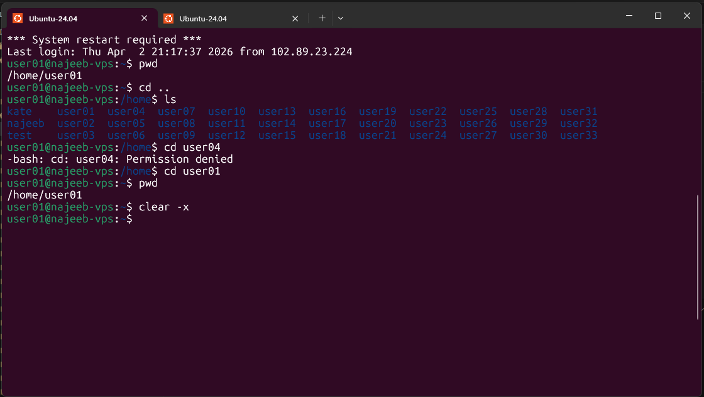

# Day 03 - [Topic]

## Objective

What was the goal for today?

---

## What I Learned

- `cd` - which mean *change directory*, used to navigate the file system by changing the current working directory.


---

## What I Built / Practiced

- changed directory using `cd`
- Moves up one level to the parent directory.
```sh
cd ..
```

---

## Challenges Faced

- None 


---

## Key Takeaways

- Navigating file system
 

---

## Resources

- 

---

## Output


```sh
pwd
cd ..
ls
cd user04
cd user01
pwd
clear -x
```
