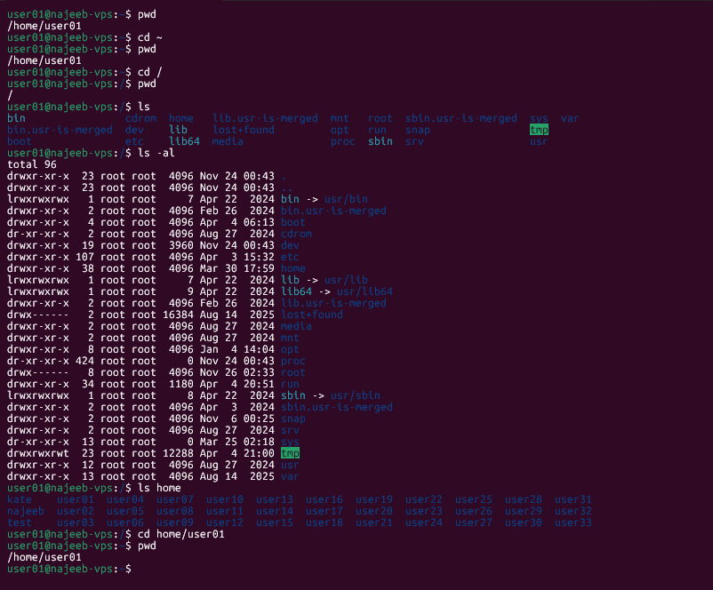

# Day 04 - [Topic]

## Objective

What was the goal for today?

- Exploring command options
- Navigating the file system
- The Root directory
- shell structure
```sh
command [options] [arguments]
```

---

## What I Learned

- Navigating the file system
    - how to navigate through file folder using  `cd`
- explored `ls` command options
- The *Root Directory* is the starting point for the file system. It actual directory name is *"/"*
- An **Absolute Path** starts with a */* - as it is the unique full location to reference a particular file or folder.
- *~* - home directory

---

## What I Built / Practiced

- Navigating the entire file system using *cd* - from home and root directory, absolute and relative path

---

## Challenges Faced

- None

---

## Key Takeaways

- Root directory
- Home directory
- Absolute path begins with */*
- Use home directory combine with particular folder or file name for absolute path from the root
```sh
cd ~/folder
```

---

## Resources

- 

---

## Output

```sh
pwd
cd ~
pwd
cd /
pwd
ls
ls -al
ls home
cd home/user01
pwd
```
