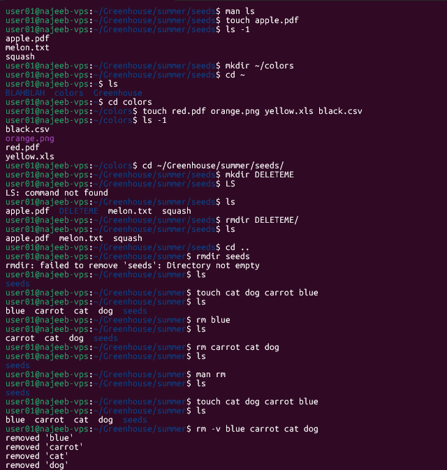

# Day 05 - [Topic]

## Objective

What was the goal for today?
- Manupulating files and directory
---

## What I Learned

- `mkdir` - short for "make directory"; is the command use to make folders
- `touch` - create an empty file. If the file exists, it opens the file in write mode, and the timstamp of the file is updated.
- `rmdir` - removes only **empty** directories
- `rm` - removes files or directory

---

## What I Built / Practiced

- Created multiple directories in a single command using `mkdir`.
```sh
mkdir winter summer
```
- Created a hierarchical directory structure using the `-p` (parents) option.
```sh
mkdir -p winter/seeds/lettuce
```
- Deleted a directory and files within it with `rm -r`

---

## Challenges Faced

- None

---

## Key Takeaways

- `rmdir` - removes only **empty** directories
- `rm` - removes files or directory

---

## Resources

- 

---

## Output

