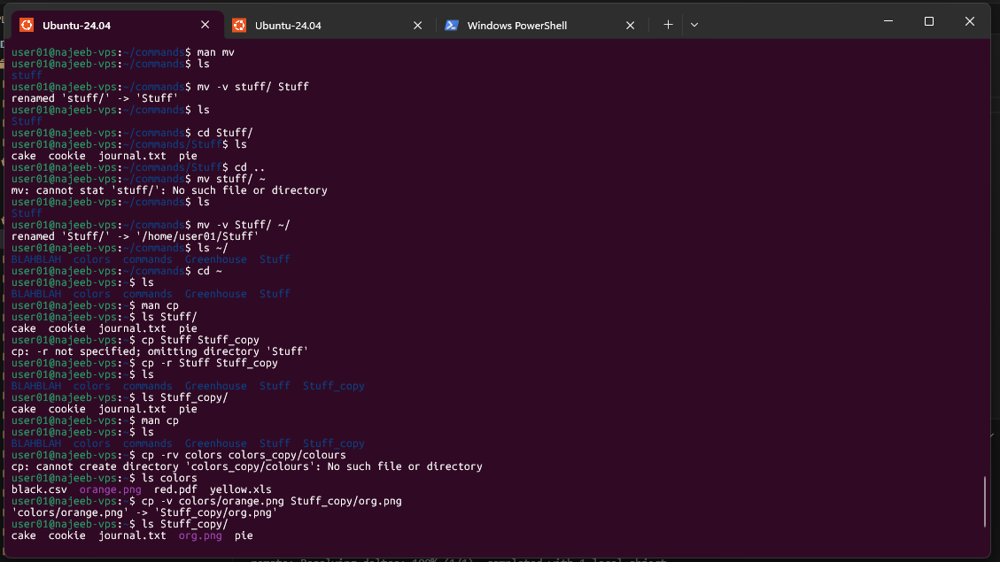

# Day 06 - [Topic]

## Objective

What was the goal for today?
- Manupulating files and directory
---

## What I Learned

- `mv` - moves or rename files
- `cp` - copy files and directory
- 

---

## What I Built / Practiced

- renamed a file using `mv` commands
- move a file into a directory
- move multiple files into a directory
- renamed a directory
- move a directory to the home directory
```sh
mv jornal.txt journal.txt
mv journal.txt stuff/
mv pie cookie cake stuff/
mv stuff/ Stuff
mv Stuff/ ~/
```
- made a copy of a file
- made a copy of a directory and it's contents
- copied a file from a directory into another directory with a different file name
```sh
cp journal.txt Today_journal.txt
cp -r Stuff Stuff_copy
cp -v colors/orange.png Stuff_copy/org.png
```
-

---

## Challenges Faced

- None
- 

---

## Key Takeaways

- To copy a directory and it entire content, use the verbose flag `cp -v ...`
- 

---

## Resources

- 

---

## Output


