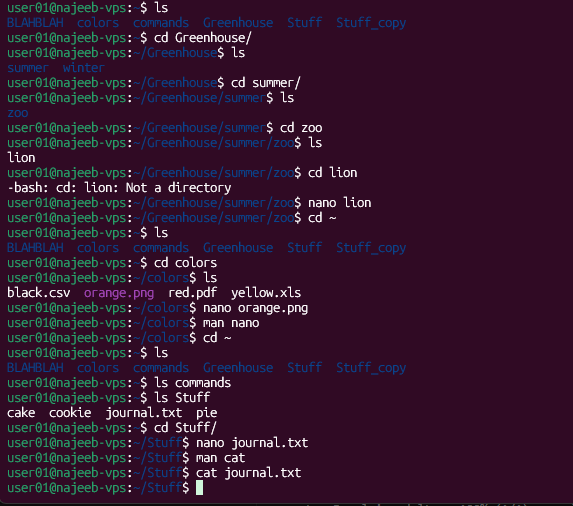

# Day 08 - [Topic]

## Objective

What was the goal for today?
- Editing and viewing files
---

## What I Learned

- `nano` -  a simple editor for viewing files
- `cat` - display content of a file
- 

---

## What I Built / Practiced

- opened a file using `nano`
- displayed content of a file using `cat`

---

## Challenges Faced

- None
- 

---

## Key Takeaways

- 
- 

---

## Resources

- 

---

## Output
