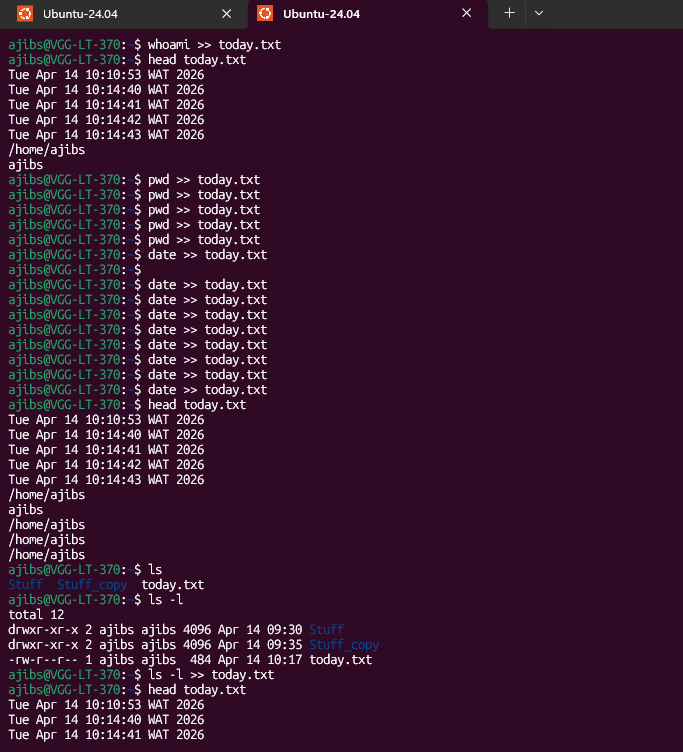

# Day 14 - [Topic]

## Objective

What was the goal for today?
- Redirecting standard output
---

## What I Learned

- `>` - redirect the output of a command into a file - **This overites the content of the files being redirected to**
- `>>` - redirect and **append** the output of a command into a file
- 

---

## What I Built / Practiced

- Redirecting the output of a command into a file - either by overwritting or appending
```sh
date > today.txt
date >> today.txt
ls -l >> today.txt
```
- 

---

## Challenges Faced

- None
- 

---

## Key Takeaways

- redirecting command output to a file. Either to rewrite or append
- 

---

## Resources

- 

---

## Output


