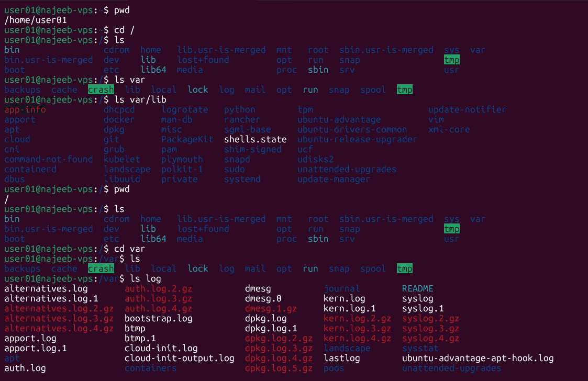

# Day 26 - [Topic]

## Objective

What was the goal for today?
- Understand what `/var` and `/var/lib` are used for in Linux
- Understand how this relates to Docker volumes

---

## What I Learned
- `/var` means variable data. It stores files that change while the system is running.
```sh
/var/log      # log files
/var/cache    # cache files
/var/lib      # persistent application data
/var/lib/docker       # Docker data
/var/lib/postgresql   # PostgreSQL data
/var/lib/rabbitmq     # RabbitMQ data
```

---

## What I Built / Practiced
- Checked the root directory `/` and saw the `/var` folder.
- Connected `/var/lib` to how Docker stores data.
- Practiced understanding Docker volume syntax.

---

## Challenges Faced

- 
- 

---

## Key Takeaways
- `/var` stores changing system and application data.
- `/var/lib` stores persistent application data.


---

## Resources

- Linux filesystem structure
- Docker volumes documentation

---

## Output

(Include links, screenshots, code snippets, or results)
